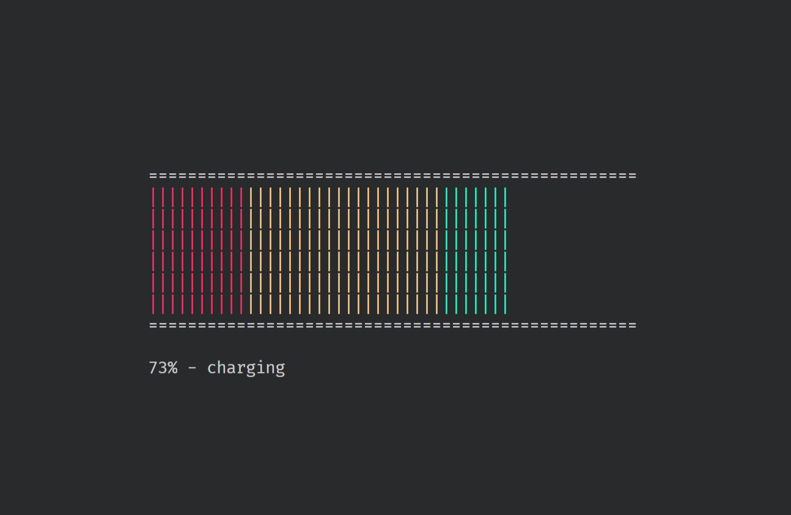

# cellrs

[](https://crates.io/crates/cellrs)
[](https://docs.rs/cellrs)




`cellrs` (pronounced "cellars") is a terminal-based battery indicator written in [Rust](https://www.rust-lang.org/).

## Overview

- `cellrs` displays a battery which resizes with the size of the terminal.
- The battery contains "cells" that scale to the current battery level. These cells are colour-coded based on the percentage of the battery.
- A status line is displayed below the battery showing numerical percentage and charging status.
- Optionally, some cells will blink when the battery is charging.
- The first four indexed batteries can be selected.

### Platforms

Supported platforms/versions are generally based on [battery](https://crates.io/crates/battery).

- Linux 2.6.39+
- MacOS 10.10+
- Windows 7+
- FreeBSD
- DragonFlyBSD

### Prerequisites

- There are no specific prerequisites for using `cellrs`.
- For developers, [Rust](https://www.rust-lang.org/), including [`cargo`](https://github.com/rust-lang/cargo/).

### Dependencies

- [battery](https://crates.io/crates/battery)
- [chrono](https://crates.io/crates/chrono)
- [termion](https://crates.io/crates/termion)

## Install/Build

There are a few ways you can get and use `cellrs`.

- Install from [crates.io](https://crates.io/). Requires [`cargo`](https://github.com/rust-lang/cargo/).

  ```sh
  cargo install cellrs
  ```

- Download a release binary from [GitLab](https://gitlab.com/leglesslamb/cellrs/-/releases) and put it somewhere in your `$PATH`.
- Build from [source](https://gitlab.com/leglesslamb/cellrs). Requires [`cargo`](https://github.com/rust-lang/cargo/).

  ```sh
  git clone https://gitlab.com/leglesslamb/cellrs.git
  cd cellrs
  make install
  ```

### Usage

```help
usage : cellrs

Command-Line Arguments

    -b [width]  Set custom blink-width [16-bit unsigned] (defaults to 1).
    -h          Display this help message.
    -[1-4]      Select battery index. The right-most option will override.
                Index-out-of-bounds will default index to 0.

Key Commands

    b       Cycle through the blink-width value.
                If your custom blink-width was 1 or unset, it will cycle
                through {1, <max-width>, 0, ...}. Otherwise, it will
                cycle through {<custom-width>, <max-width>, 0, ...}.
    q       Quit cellrs.
    [1-4]   Switch between up to the first four indexed batteries.
                Index-out-of-bounds will default index to 0.
```

---

## Development/Pages

- [**Homepage**](https://leglesslamb.gitlab.io/post/cellrs)
- [**GitLab**](https://gitlab.com/leglesslamb/cellrs)
  - Working issues and Merge Requests (MRs) are reviewed.
  - Bug reports and feature requests are preferred.
- [**GitHub (Mirror)**](https://github.com/leglesslamb/cellrs)
  - Bug reports and feature requests are accepted.
- [**crates.io**](https://crates.io/crates/cellrs).

---

## Acknowledgements

- [Valerio Besozzi](https://github.com/valebes)'s [rsClock](https://github.com/valebes/rsClock) for inspiring this project.
